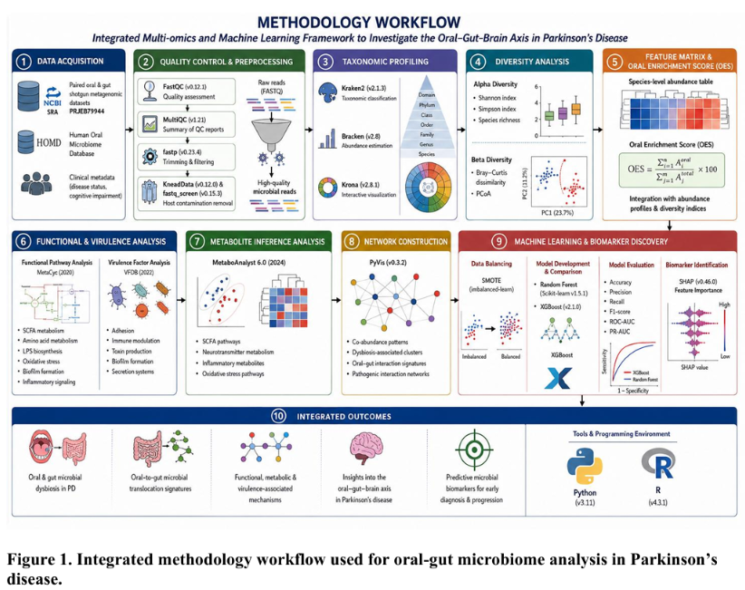

# 🧬 Multi-Omics Characterization of the Oral–Gut–Brain Axis in Parkinson's Disease


---

## 📖 Overview

This repository contains the source code, analysis workflow, documentation, and supporting files for my **Master of Science (M.Sc.) Bioinformatics Thesis** submitted to **REVA University**.

The project investigates the **Oral–Gut–Brain Axis** in **Parkinson's Disease (PD)** using **shotgun metagenomics**, **functional microbiome analysis**, **network biology**, and **machine learning** to identify microbial translocation signatures and predictive biomarkers associated with disease progression.

---

## 📌 Project Title

**Multi-Omics Characterization of the Oral–Gut–Brain Axis in Parkinson's Disease: Identification of Microbial Translocation Signatures and Biomarkers**

---

# 🖼 Methodology

<p align="center">

</p>

---

# 🔬 Research Objectives

- Investigate oral and gut microbial dysbiosis in Parkinson's Disease.
- Identify oral-to-gut microbial translocation signatures.
- Characterize microbial functional pathways.
- Explore virulence factor enrichment.
- Develop machine learning models for disease prediction.
- Identify microbial biomarkers associated with disease progression.

---

# 📂 Dataset

| Item | Description |
|------|-------------|
| Project ID | PRJEB79944 |
| Source | European Nucleotide Archive (ENA) |
| Data Type | Shotgun Metagenomics |
| Total Samples | 241 |

### Clinical Groups

| Group | Samples |
|-------|---------|
| Healthy Controls (HC) | 52 |
| Parkinson's Disease (PD) | 20 |
| PD with Mild Cognitive Impairment (PD-MCI) | 78 |
| Parkinson's Disease Dementia (PDD) | 91 |

---

# 🔄 Analysis Workflow

<p align="center">

</p>

> **Note**
>
> Raw sequencing preprocessing was performed using an institutional pipeline. The preprocessing workflow is **not included** due to confidentiality restrictions. All downstream statistical analyses, machine learning models, visualization scripts, and biomarker analyses are available in this repository.

---

# 🛠 Bioinformatics Pipeline

## Quality Control

- FastQC
- MultiQC
- fastp
- KneadData
- FastQ Screen

## Taxonomic Profiling

- Kraken2
- Bracken
- Krona

## Functional Profiling

- HUMAnN3
- MetaCyc
- VFDB

## Statistical Analysis

- DESeq2
- Alpha Diversity
- Beta Diversity
- Differential Abundance
- Oral Enrichment Score (OES)

## Machine Learning

- XGBoost
- Random Forest
- SMOTE
- Feature Engineering
- Cross Validation
- SHAP Explainability

## Visualization

- Matplotlib
- Seaborn
- Plotly
- PyVis
- NetworkX

---

# ⚙ Technologies Used

| Category | Tools |
|-----------|------|
| Programming | Python, R |
| Workflow | Nextflow |
| Taxonomy | Kraken2, Bracken |
| Functional Analysis | HUMAnN3, MetaCyc, VFDB |
| Statistics | DESeq2 |
| Machine Learning | XGBoost, Random Forest |
| Visualization | Matplotlib, Seaborn, PyVis |
| Networks | NetworkX |

---

# 🤖 Machine Learning Pipeline

### Features

- Species abundance
- Alpha diversity
- Beta diversity
- Oral Enrichment Score
- Functional pathways
- Virulence factors

### Models

- Random Forest
- XGBoost

### Evaluation Metrics

- Accuracy
- Precision
- Recall
- F1 Score
- ROC-AUC
- PR-AUC

---

# 📊 Key Findings

- Oral microbial dysbiosis progressively increased across Parkinson's disease stages.
- Elevated Oral Enrichment Score indicated potential oral-to-gut microbial translocation.
- Functional pathway alterations suggested increased inflammatory activity.
- Virulence factor enrichment supported microbial involvement in neurodegeneration.
- Machine learning models accurately classified disease status.
- Several microbial biomarkers associated with Parkinson's disease progression were identified.

---

# 📁 Repository Structure

```text
parkinsons-oral-gut-brain-axis
│
├── data/
│   ├── metadata/
│   ├── processed/
│   └── abundance_tables/
│
├── scripts/
│   ├── preprocessing/
│   ├── taxonomy/
│   ├── diversity/
│   ├── machine_learning/
│   ├── functional_analysis/
│   └── visualization/
│
├── notebooks/
│
├── figures/
│
├── Results/
│
├── docs/
│
├── methodology.png
├── workflow.png
├── README.md
├── requirements.txt
└── LICENSE
```

---

# 🚀 Installation

Clone the repository

```bash
git clone https://github.com/Praveen26-09/parkinsons-oral-gut-brain-axis.git
```

Move into the project

```bash
cd parkinsons-oral-gut-brain-axis
```

Install dependencies

```bash
pip install -r requirements.txt
```

---

# 📦 Requirements

Python **3.10+**

Major packages

```text
numpy
pandas
scikit-learn
xgboost
matplotlib
seaborn
networkx
pyvis
scipy
shap
biopython
```

---

# 📈 Results

The repository contains

- Microbial diversity analysis
- Differential abundance analysis
- Oral Enrichment Score
- Biomarker discovery
- Functional pathway analysis
- Virulence factor analysis
- Machine learning models
- Feature importance
- Network analysis

> **Note:** Due to repository size limitations, some large intermediate datasets are not included.

---

# 🔮 Future Work

- External validation using independent cohorts
- Multi-omics integration
- Metabolomics analysis
- Explainable AI
- Clinical biomarker validation
- Longitudinal microbiome studies

---

# 📄 Citation

If you use this work in your research, please cite:

```text
Praveen Kumar S.

Multi-Omics Characterization of the Oral–Gut–Brain Axis in Parkinson's Disease:
Identification of Microbial Translocation Signatures and Biomarkers.

Master of Science Thesis
Department of Bioinformatics
REVA University
2026
```

---

# 👨‍💻 Author

**Praveen Kumar S**  
🎓 M.Sc. Bioinformatics, REVA University

📧 **Email:** <praveen26092001@gmail.com>  
💼 **LinkedIn:** <https://www.linkedin.com/in/praveen-kumar-s-104269230>

---

# ⭐ Acknowledgements

I sincerely thank

- REVA University
- Department of Bioinformatics
- Dr. Agnik Haldar (Internal Guide)
- Ms. Shalini Mahadev (External Guide)
- Public data contributors through the European Nucleotide Archive (ENA)

---

# 📜 License

This project is licensed under the MIT License.

See the **LICENSE** file for details.
